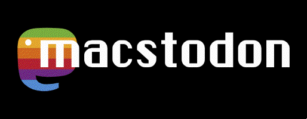

<h1 align="center"></h1>
<h4 align="center">A silly little Mastodon client for Classic Mac OS</h4>

## About
Macstodon is an app written in MacPython 1.5.2 for Classic Mac OS that lets you post a plain text toot to a Mastodon server.

It has been developed on a Macintosh IIfx running System 7.1.1, and should run on any 68K Mac OS version from 7.1 through 8.1.
The following extensions are required, and are distributed with Macstodon:
 - CFM-68K Runtime Enabler
 - ObjectSupportLib
 - NuDragLib.slb

For System 7 users, installing Internet Config is strongly recommended as it will:
 - allow Macstodon to automatically open your web browser to the authentication URL during the login process
 - allow you to globally set a HTTP proxy, so that you can use an SSL proxy. Without this you are restricted to pure HTTP instances (are there even any?)

**No support is provided for this app, and I don't plan on maintaining it long-term. This is just a fun hack project, not a serious development effort.**

## Screenshots

    
    
    

## Features
It lets you authenticate and post toots in plain text - that's it! No timelines or support for any other Mastodon features. Not yet anyway. Maybe in the future.

## How to Run It
1. Download and install Macstodon from the Releases page: <https://github.com/smallsco/macstodon/releases>
2. Decompress the archive and place the Macstodon application whereever you like.
3. If you're running System 7, copy the files in the `Required Extensions - System 7` folder into the `Extensions` folder (subdirectory of `System Folder`) and reboot your Mac.
4. Double-click the Macstodon app to run it!
5. Now the program is running. Type the full URL to your Mastodon server, minus the trailing slash, and click "Login".
6. Your web browser will launch to a Mastodon authentication page. Log in, and you will be redirected to a page with a code on it.
7. Copy this code and return to the Macstodon application. In the `Auth` window that has appeared, paste this code, and click the `OK` button.
8. You will now be at the Toot window. Type some text into the text area and press the `Toot!` button to post it to Mastodon.
9. When you're done, quit the Python IDE. The next time you run it, you will not need to re-authenticate.

## How to compile it
1. Download and install MacPython 1.5.2 from here: <https://homepages.cwi.nl/~jack/macpython/downloads/old/MacPython152.hqx>
2. Decompress the `Macstodon.rsrc.sit.hqx` file until you have `Macstodon.rsrc`. Keep this in the same directory as `Macstodon.py`.
3. Drag and drop `Macstodon.py` onto the `BuildApplication` app that comes with MacPython.
4. Select the `Build 68k Application` option.
5. Select where you want to save the app.
6. Wait about 10 minutes or so for it to finish.

## Known Issues
* SSL is not supported at all. You will need to run an SSL-stripping proxy on another machine and configure your Mac to use it. I recommend using [WebOne](https://github.com/atauenis/webone). Note that you will probably need to add your Mastodon server to the `ForceHTTPS` section of WebOne's config file (it depends on how your Mastodon instance is configured). Some instances (i.e. `bitbang.social`) also require that the user-agent is configured to something modern-looking like `Mozilla/5.0 (Macintosh; Intel Mac OS X 10_15_7) AppleWebKit/605.1.15 (KHTML, like Gecko) Version/16.2 Safari/605.1.15`
* This also means you'll need to use `http` instead of `https` in the server URL - Python 1.5.2's `urllib` doesn't have any support whatsoever for `https`.
* Performance can be pretty bad when it comes to parsing large JSON responses.
* There is no support for Unicode whatsoever. This app may not work for you if you have an emoji in your username. Sorry.
* I'm not building this for PowerPC because the Python interpreter for PPC isn't respecting the runtime prefs embedded in the resource file. But a PPC build should probably be made with a newer version of MacPython anyway.

## Troubleshooting
When in doubt, delete the preferences file. It is named `Macstodon Prefs` and lives in the Preferences folder in your System Folder. Deleting the preferences file will make Macstodon forget about the saved server, tokens, etc.

## Credits
Special thanks to the following third-party software, for whom without Macstodon would not be possible:

**JSON Decoding Algorithm**  
Copyright ©2016 Henri Tuhola  
License: MIT
<https://github.com/cheery/json-algorithm>

Extra special thanks to:  
[Dan](https://mastodon.lol/@billgoats) - for the inspiration to work on this project  
[Mingo](https://oldbytes.space/@mingo) - for [suggesting the name](https://oldbytes.space/@mingo/109316322622806248)  
[MhzModels](https://mastodon.art/@mhzmodels) - for the beautiful logo at the top of this README, and the Macstodon application icon!
